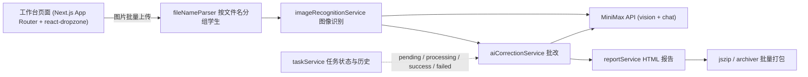

# 作文 AI 批改工具


批量上传学生作文图片，通过 MiniMax AI 自动识别文字并进行作文批改，生成详细的 HTML 报告。

## 功能

- 批量上传作文图片（支持 jpg/png/webp）
- 自动按文件名分组学生作文
- AI 图像识别提取文字
- AI 作文批改（评分、优点、问题、修改建议）
- 生成改良版作文
- 工作台式批改流程（规则、上传、进度、结果在同一页）
- 批量下载已成功报告（ZIP）
- 任务历史记录、单篇重试与一键重试失败项

## 架构



### 服务层（`src/services/`）

| 服务 | 职责 |
|---|---|
| `fileNameParser` | 按 `学生姓名-页码.jpg` 规则自动分组多页作文 |
| `imageRecognitionService` | 调用 MiniMax 视觉模型提取作文文字 |
| `aiCorrectionService` / `minimaxService` | 批改调用、评分与结构化建议输出 |
| `reportService` / `summaryService` | HTML 报告与批改总结生成 |
| `taskService` | 任务状态机与历史记录 |

### 工程亮点

- **超时与重试治理**：批改调用 `MINIMAX_CORRECTION_TIMEOUT_MS=300000`、失败重试 2 次、延迟 5s——针对长文批改的真实耗时校准
- **fire-and-forget 重试接口**：重试请求立即返回、后台继续处理，避免 HTTP 连接卡住 1-2 分钟
- **Next.js standalone 输出**：生产构建仅含运行时依赖，Docker 镜像精简
- **质量脚本**：`npm run test` 跑 `scripts/quality-check.ts` 质量检查，`scripts/retry-failed.ts` 一键重试失败任务

## 快速部署（Docker）

### 前置要求
- Docker >= 20.10
- Docker Compose >= 2.0

### 启动步骤

1. 复制环境配置文件：
```bash
cp .env.example .env
```

2. 编辑 `.env`，填入你的 API Key：
```
MINIMAX_API_KEY=你的_MiniMax_API_密钥
MINIMAX_API_HOST=https://api.minimaxi.com
MINIMAX_TEXT_MODEL=MiniMax-M3
MINIMAX_VISION_MODEL=MiniMax-M3
MINIMAX_CORRECTION_TEMPERATURE=0.3
MINIMAX_CORRECTION_TIMEOUT_MS=300000
MINIMAX_CORRECTION_MAX_TOKENS=12000
MINIMAX_CORRECTION_MAX_RETRIES=2
MINIMAX_CORRECTION_RETRY_DELAY_MS=5000
```

3. 构建并启动：
```bash
docker-compose up -d
```

4. 访问 http://localhost:3000

### 常用命令

```bash
# 查看日志
docker-compose logs -f

# 停止服务
docker-compose down

# 重启服务
docker-compose restart
```

## 本地开发

```bash
npm install
npm run dev
```

访问 http://localhost:3000

## 质量检查

```bash
npm run lint
npm run test
npm run build
```

生产构建使用 Next.js standalone 输出，`npm run start` 会运行 `.next/standalone/server.js`。请先执行 `npm run build`。

## 文件命名规则

上传图片时请按 `学生姓名-页码.jpg` 格式命名，例如：
- `张三-1.jpg`、`张三-2.jpg`
- `李四-1.jpg`

系统会自动按学生姓名分组。

## 技术栈

- Next.js 16 + React 19 + TypeScript + Tailwind CSS 4
- MiniMax MCP（图像识别）
- MiniMax Chat API（作文批改）
- JSZip / archiver（报告打包）
